# Joylink 京东云接入指南

## 1. 介绍

joylink 京东小京鱼 IoT 开放平台（以下简称京东云） 可以为京东平台产品提供一体化的智能解决方案，包括 App、云服务、数据运算、增值服务等，使得该产品可以和京东云平台上其他品牌产品实现相互连接，为用户提供更好的使用体验 。

joylink 软件包是 RT-Thread 系统基于 joylink v2.0.19 版本移植的用于连接京东云 IoT 平台的软件包，该软件包目前完成功能：

- 设备激活上线；
- 设备信息存储；
- 自定义数据收发功能；
- softap 配网功能；
- thunderconfig 配网（音箱配网）功能；
- 联盛德 W600 W601 支持


### 1.2 依赖

- RT-Thread 4.0.1 +

- [cJSON 软件包](https://github.com/RT-Thread-packages/cJSON)

- [EasyFlash 软件包](https://github.com/armink-rtt-pkgs/EasyFlash)

- RTC 设备支持

- WLAN 驱动框架


## 2. 软件包使用

下面分三个部分介绍京东云接入和软件包使用流程：

- 云端准备流程；

- 参数配置和移植流程；

- 软件包运行流程；

### 2.1 云端准备流程

**1. 账号注册登录**

京东云平台地址：https://jdwhale.jd.com

可以使用个人京东账号登录，也可以注册企业账号登录，建议注册使用企业账号。

**2. 创建产品**

参考官方 [创建产品说明](https://smartdev.jd.com/docCenterDoc/view/2/101/95400002/95900004#topMaoDot) ，创建成功之后需要获取并记录产品 **UUID** 和 **Product Key（公钥）**，用于后面设备的激活和认证过程。

如下图所示为创建产品基本参数，当前创建的产品类型为**智能手环**：

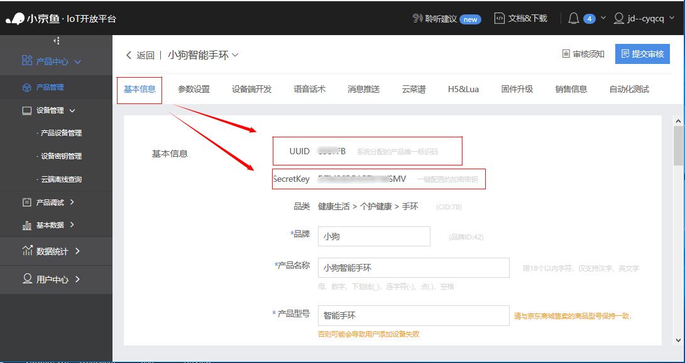

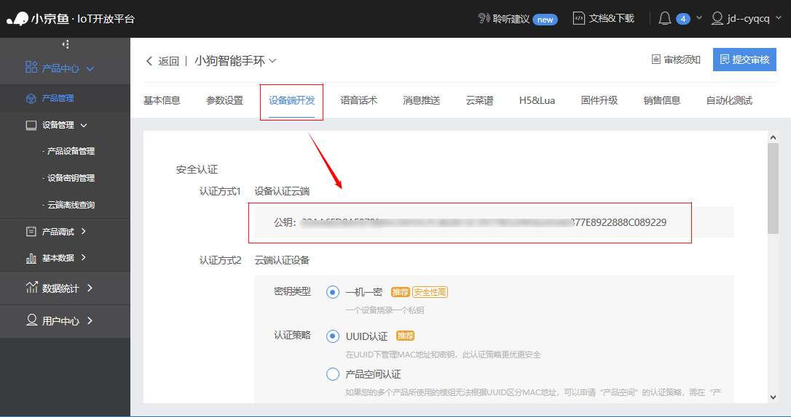

**3. 通过 MAC 地址生成设备密钥**

创建产品之后，正常应该是创建新设备，京东云提供 **设备密钥管理** 机制，通过表格传入的设备 **MAC 地址**生成该 MAC 地址设备特有的**Private Key（设备私钥）**，用于设备激活认证。


进入`设备密钥管理`， 选中上面创建的产品，点击右边 `密钥管理`， 点击 `导入 MAC 地址`，按照 MAC 地址表格模板填写 MAC 地址，点击  `导入`。导入成功之后，再次点击进入 `密钥管理`，可以查看密钥列表，如下所示：

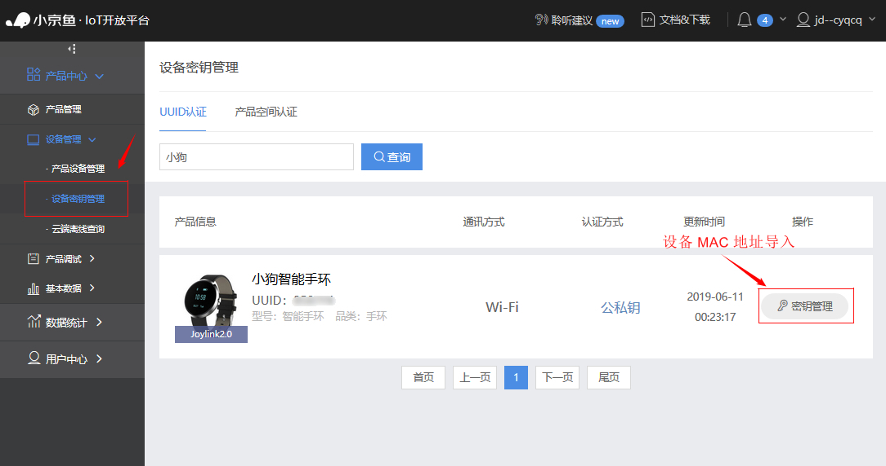

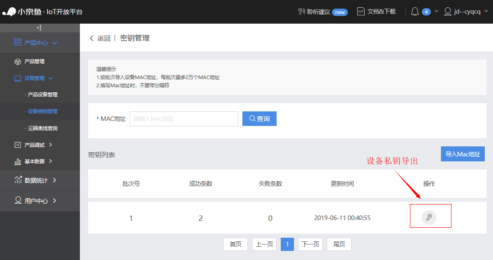

至此，针对每一个设备，获取到了四个重要的属性信息，分别是：

- **UUID**：产品唯一标识
- **Product Key**：产品公钥
- **MAC**：设备硬件地址
- **Device Key**：设备私钥

### 2.2 参数配置流程

通过上述云端准备流程获取产品相关信息，之后可以在 menuconfig 中配置信息， menuconfig 配置如下：

```shell
[*] Joylink: Joylink IoT SDK poting for RT-Thread
    [ ]  Enable OTA update feature
    [ ]  Enable network configure feature
    [ ]  Enable thunderconfig mode
         Output LOG level (DEBUG)  --->
         Sample product type (Heater)  --->
    [*]  Enable automatic initialize
    (uuid) Device uuid
    (public_key) Device public key
    (private_key) Device private key
    Version (latest)  --->
```

- **Enable OTA update feature**：配置开启 OTA 功能支持；同时需要自行移植
- **Enable network configure feature**：配置配网方式支持，目前有两种：softap、thunderconfig；同时需要自行移植
- **Enable softap mode**: 开启手机热点配网功能支持；同时需要自行移植
- **Enable thunderconfig mode**：开启叮咚/京鱼座音箱配网功能支持；同时需要自行移植
- **Output LOG level**：配置日志等级，目前支持等级：DEBUG、WARN、ERROR、INFO、NOTICE、FATAL
- **Sample product type**：配置示例类型，目前支持两种：Heater、Wristband
- **Enable automatic initialize**：配置开启云端自启动功能支持 
- **Device uuid**：配置示例产品 UUID
- **Device public key**：配置示例产品公钥
- **Device private key**：配置示例设备私钥（该设备 MAC 地址对应私钥）

### 软件包运行流程

下载编译运行成功，设备上电，连接网络成功，若想要设备在云端上线需要  **小京鱼 APP** 配合设备完成设备激活过程。

**1. 下载安装小京鱼 APP**

小京鱼 APP 下载地址：https://smartdev.jd.com/docCenterDownload/download/156100001

下载完成，使用创建产品和设备的京东账号登录。

**2. 设备二维码生成**

每个设备对应一个二维码，用于设备的联网和激活认证，在 `产品管理`->`销售信息` -> `二维码`处生成，如下图所示：

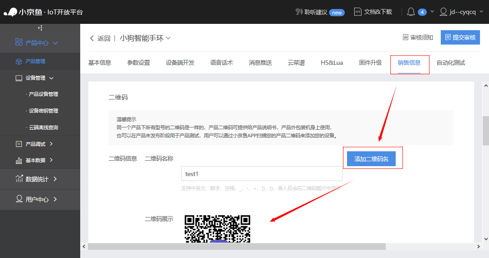

需要注意的一点，**只有在产品基本信息填写完整的情况下，二维码才能正常显示**。


**3. 云端启动**

设备第一次上线进入配网模式，默认开启 softap 配网方式，如下图所示：

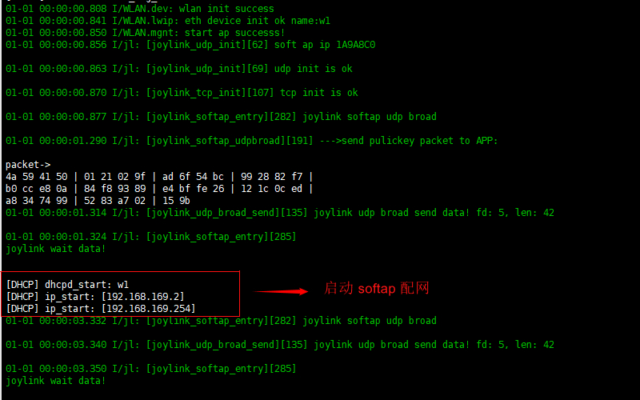

**4. SoftAP 配网功能**

目前设备默认配网方式为 SoftAP 配网， SoftAP 配网支持**设备自行激活绑定**的绑定策略，设备在配网之前需要在云端配置设备配网信息，具体 softap 配网方式使用流程如下：

- **设置产品配网方式**

  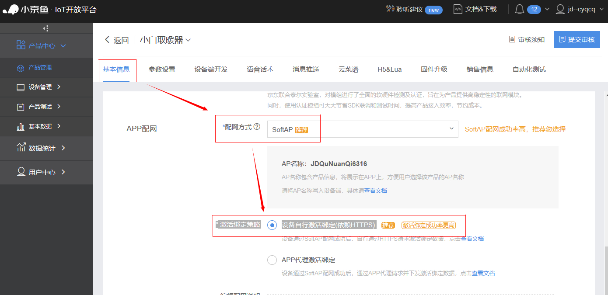

  产品管理，基本信息界面，设置配网方式为`SoftAP`（有些模块不支持该配网方式，这里使用联盛德 W600模块），设置激活绑定策略为`设备自行激活`；

  获取当前产品 AP 名称为 `JDQuNuanQi6316`，用于 ENV 选项配置。

- **配置工程参数**

  使用 ENV 工具，配置 SoftAP 配网模式，配置使用的 AP 名称。

  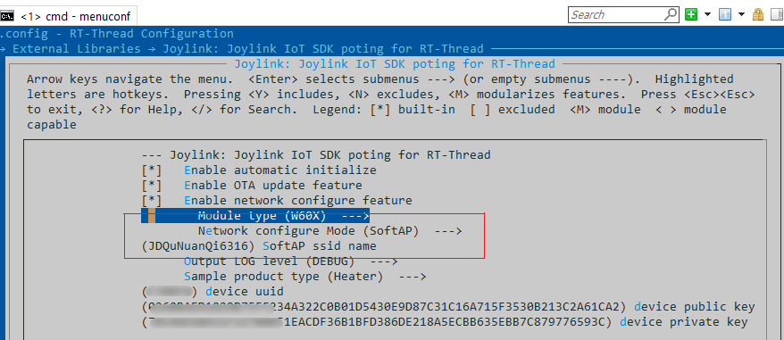

- **使用 APP 配网**

  手机连接设备需要连接配置的 WIFI，进入小京鱼 APP，点击设备又上角加上 “+” 号，扫描产品生成的二维码，设备进入配网。配网完成，设备提示`配网成功`，之后设备进入自动激活过程，激活完成手机 APP 中能查看配网成功的设备。

  注：如果 APP 提示`配网失败`，需要 FinSH 中执行 `joylink_stop` 停止配网，再执行 `joylink_start` 命令再次进入配网，手机重新扫描配网。

  softap 网成功如下图所示：

  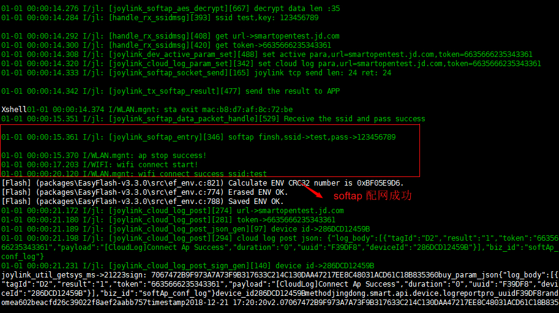


**5. thunderconfig 配网**

除了 softap 配网，京东云还支持叮咚/京鱼座音箱配网，需要 menuconfig 配置中开启 `thunderconfig mode` 配网模式支持，并且叮咚/京鱼座音箱固件版本为最新版本（需要联系京东云官方支持确定音箱版本是否支持音箱配网）。

首先通过小京鱼 APP 给叮咚/京鱼座音箱配网，使音箱设备连接 WIFI，然后让设备进入待配网模式，设备默认使用 softap 配网方式，可以在 FinSH 中执行 `joylink_mod_change` 命令切换配网状态为 thunderconfig 配网。然后通过语音唤醒音箱配网功能，设备端会收到音箱发送的配网信息并自动连接网络。示例使用音箱设备为`京鱼座 A1 音箱`，音箱固件版本为 `206`，设备 thunderconfig 配网连接日志如下所示：

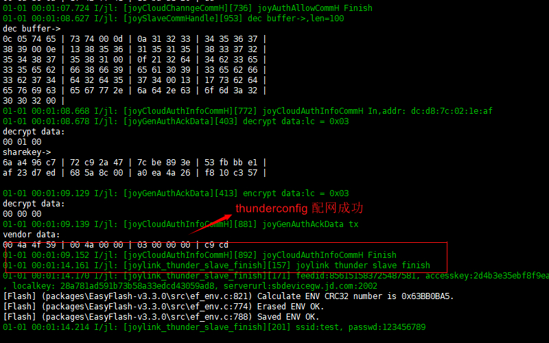

**6. 设备上线**

配网成功之后，设备自动上线，设备上线后云端可以通过获取的设备 **Feed ID** 查看设备在线情况，也可以查看设备日志等信息。

设备端激活完成之后，可以向云端发送自定义的 JSON 数据格式，如果没有数据发送，设备端也会定期发送心跳数据检查连接状态。

**7. OTA 升级功能**

menuconfig 配置中如果开启 `Enable OTA update feature`   选项，则产品支持固件 OTA 空中升级功能。

OTA 升级主要分为如下几个步骤：

- **更新设备分区表**
    更新设备分区表

- **本地生成最新固件**

   OTA 功能配置完成，编译生成最新固件，joylink 软件包固件升级只支持后缀为 `.bin` 文件，如果工程中生成的可用于固件升级的文件是其他后缀名称，需要将文件修改为 `.bin` 后缀用于后面云端固件上传。

- **上传固件到云端**

  固件准备完成之后，需要上传最新固件到云端，选择`产品管理` -> `固件升级` -> `添加固件`：

  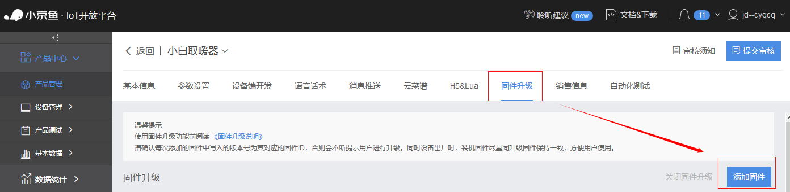

  然后进入添加固件界面，选择版本号为`标准` 或 `自定义`，输入自定义版本信息；然后点击 `添加文件`，选择刚才生成的`realthread_upload.bin` 文件上传；然后添加 APP展示信息，可以使用推荐的默认文案，最后点击`保存`按键上传固件。

  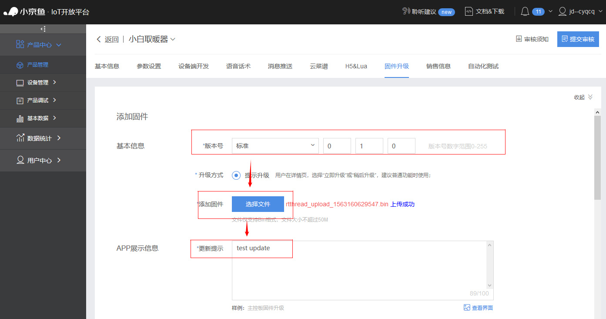

  **注意**：产品第一次上传固件默认为基础版本，不做固件更新，如果想要在 APP 中显示有新版本更新，则**产品固件列表中必须有两个或两个以上固件**。

- **APP 端下发 OTA 升级控制**

  云端上传固件完成之后，APP 端会显示有最新固件可以升级，如下所示：

  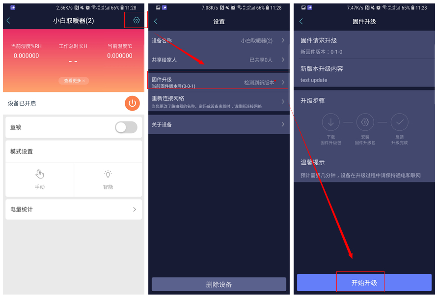

- **设备端固件升级**

  APP 点击开始升级之后，会向设备端下发 OTA 升级信息，设备接收到之后开始进入设备升级，升级流程如图所示：

  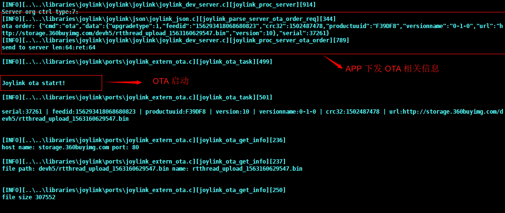

- **重启设备完成 OTA 升级**

  设备端 OTA 文件下载完成， APP 上提示 `固件升级成功，待设备重启后即可使用！`，重启设备进入 Bootloader 固件更新，固件升级完成。

**8. 更多命令支持**

FinSH 中执行 `joylink_stop` 命令，用于关闭 joylink 云端连接。如果开启 Wristband 类型产品示例支持，执行` joylink_band_set` 命令，用于设置产品对应信息。

```shell
msh />joylink_band_set sport 1  // 设备手环产品信息
[DEBUG][packages\joylink-latest\samples\joylink_sample_band.c][joylink_dev_user_data_set][85]
set wristband device sport status(1).
msh />
msh />joylink_band_set sleep 2 
[DEBUG][packages\joylink-latest\samples\joylink_sample_band.c][joylink_dev_user_data_set][90]
set wristband device sleep status(2).
msh />
msh />joylink_band_set physique 3
[DEBUG][packages\joylink-latest\samples\joylink_sample_band.c][joylink_dev_user_data_set][95]
set wristband device physique status(3).
....
[INFO][packages\joylink-latest\samples\joylink_sample_band.c][joylink_dev_get_snap_shot_with_retcode][343] // 拼接当前设备信息到云端
------>{
	"code":	0,
	"streams":	[{
			"stream_id":	"Sport",
			"current_value":	"1"
		}, {
			"stream_id":	"Sleep",
			"current_value":	"2"
		}, {
			"stream_id":	"Physique",
			"current_value":	"3"
		}]
}:len:199

[DEBUG][packages\joylink-latest\joylink\joylink\joylink_dev_server.c][joylink_server_upload_req][330]
send to server len:224:ret:224   // 上传设置的当前设备信息到云端
...
```

## 3. 注意事项

- 开启示例功能，需要在源码中修改三个配置参数，且针对不同设备参数不同。
- 如果 `产品管理`->`销售信息`中不显示 二维码，需要先补全产品基本信息。
- OTA 功能默认关闭，功能实现需要自行移植
- 配网功能默认关闭，功能实现需要自行移植
- EASYFLASH 的移植部分需要自行完成 [EASYFLASH](https://github.com/armink-rtt-pkgs/EasyFlash)

## 4. 技术支持
- 现已在联盛德 w60X 等设备上全面支持了配网和 OTA 功能
- 更多模块接入和功能支持请联系 [RT-Thread 官网商务](https://www.rt-thread.org/)

## 参考资料

- 京东云官网：https://jdwhale.jd.com/
- 京东云官方文档中心：https://smartdev.jd.com/docCenterDoc/index
- 京东云下载中心：https://smartdev.jd.com/docCenterDownload/list/2

